# SIGPDA — Diagramas del Sistema

**Tesis de Ingeniería de Sistemas — Valle Jequetepeque**

> Los diagramas están escritos en [Mermaid](https://mermaid.js.org/) y se renderizan automáticamente en GitHub, GitLab y VS Code (extensión Markdown Preview Mermaid).

---

## Índice

1. [Modelo de Datos (ERD)](#1-modelo-de-datos-erd)
   - 1.1 Dominio Operacional
   - 1.2 Dominio de Inteligencia Artificial
2. [Modelo de Arquitectura](#2-modelo-de-arquitectura)
3. [Modelo de Capas](#3-modelo-de-capas)
4. [Modelo de Despliegue](#4-modelo-de-despliegue)
5. [Flujo del Módulo IA — Comparación Automática](#5-flujo-del-módulo-ia--comparación-automática)
6. [Arquitectura del Transformer Híbrido](#6-arquitectura-del-transformer-híbrido)
7. [Flujo de la Prueba Diebold-Mariano](#7-flujo-de-la-prueba-diebold-mariano)
8. [Diagrama de Casos de Uso](#8-diagrama-de-casos-de-uso)
9. [Diagrama de Secuencia — Comparación de Modelos](#9-diagrama-de-secuencia--comparación-de-modelos)

---

## 1. Modelo de Datos (ERD)

### 1.1 Dominio Operacional

Entidades principales del sistema de gestión restaurante-PyME.

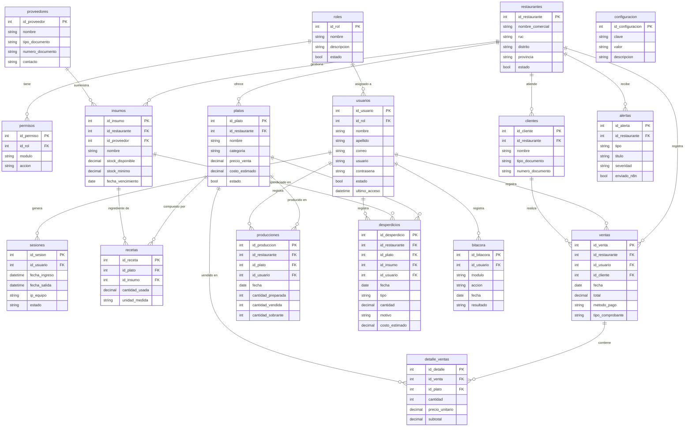

---

### 1.2 Dominio de Inteligencia Artificial

Tablas del módulo de predicción y comparación automática de modelos.

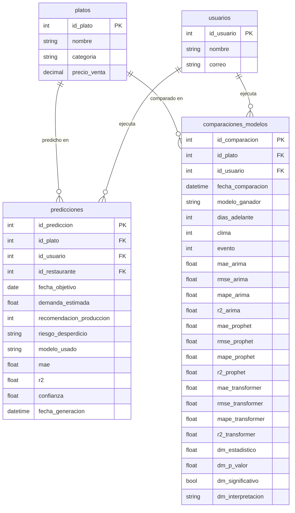

---

## 2. Modelo de Arquitectura

Visión general de los componentes del sistema y sus interacciones.

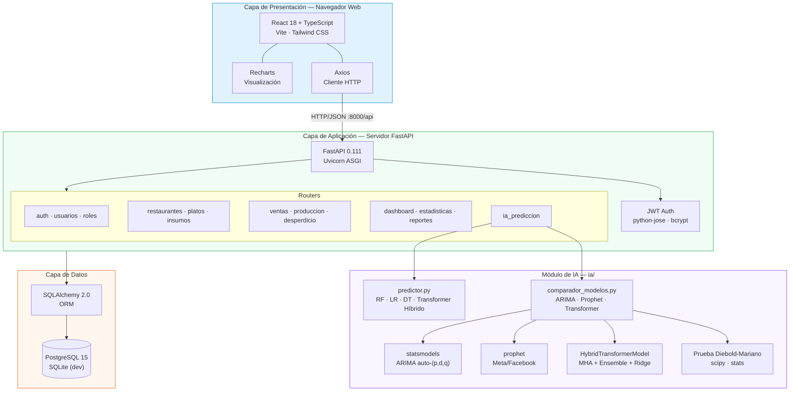

---

## 3. Modelo de Capas

Arquitectura en cuatro capas siguiendo el patrón N-Tier.

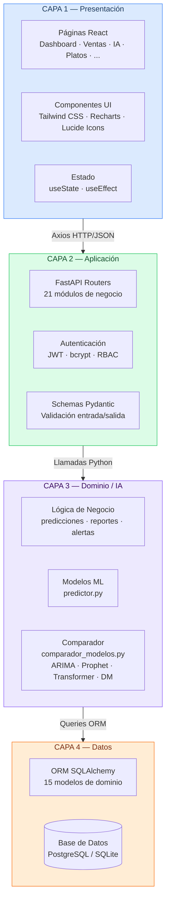

---

## 4. Modelo de Despliegue

Infraestructura de ejecución para desarrollo y producción.

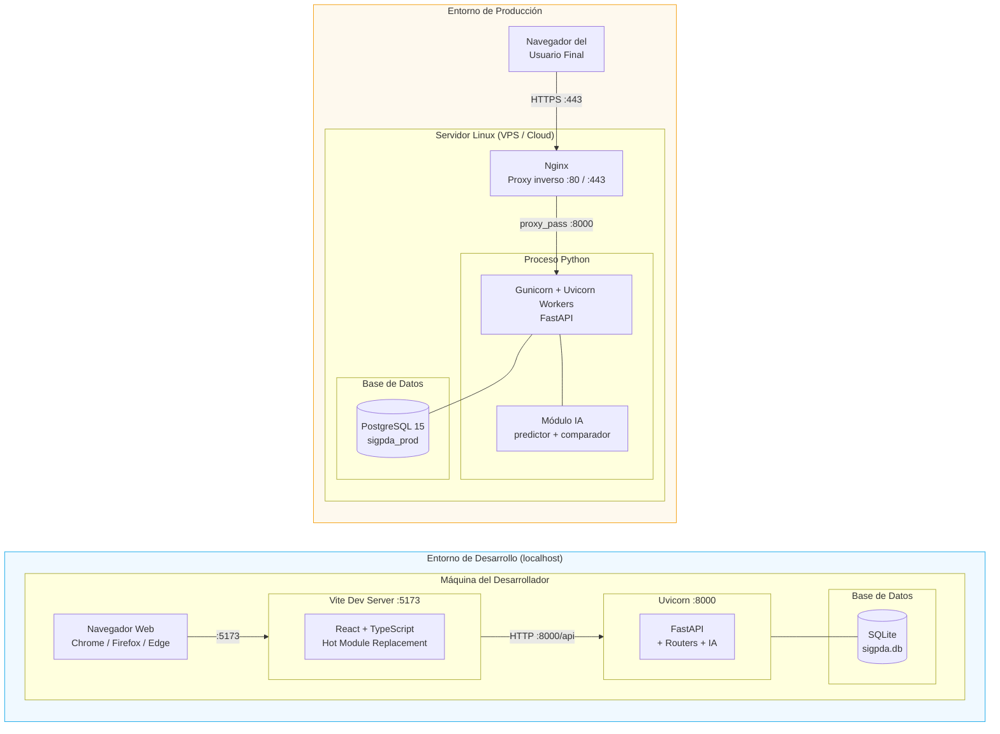

---

## 5. Flujo del Módulo IA — Comparación Automática

Flujo interno de la función `comparar_modelos_prediccion()` en `ia/comparador_modelos.py`.

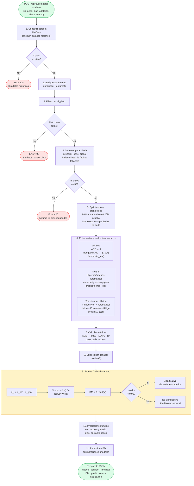

---

## 6. Arquitectura del Transformer Híbrido

Modelo propuesto de la tesis: Multi-Head Self-Attention + Ensemble + Ridge Meta-Learner, implementado en NumPy puro (sin PyTorch ni TensorFlow).

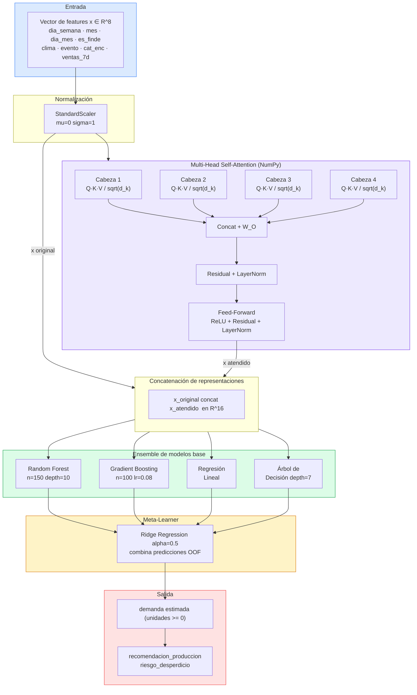

### Hiperparámetros automáticos del Transformer

| Tamaño del dataset | n_heads | d_k | Dimensión de atención |
|---|---|---|---|
| n >= 200 muestras | 4 | 16 | 64 |
| 100 <= n < 200    | 4 | 8  | 32 |
| 50 <= n < 100     | 2 | 8  | 16 |
| n < 50            | 2 | 4  | 8  |

---

## 7. Flujo de la Prueba Diebold-Mariano

Implementación de la prueba estadística de Diebold & Mariano (1995) para validar que la diferencia de precisión entre el modelo ganador y los demás es estadísticamente significativa.

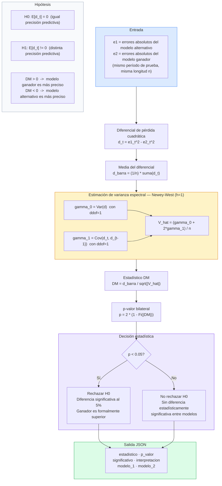

---

## 8. Diagrama de Casos de Uso

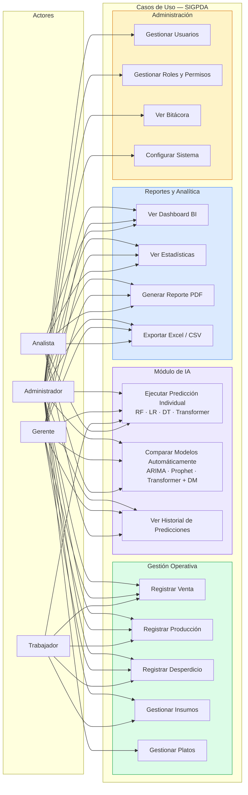

---

## 9. Diagrama de Secuencia — Comparación de Modelos

Interacción completa al ejecutar una comparación automática desde el frontend.

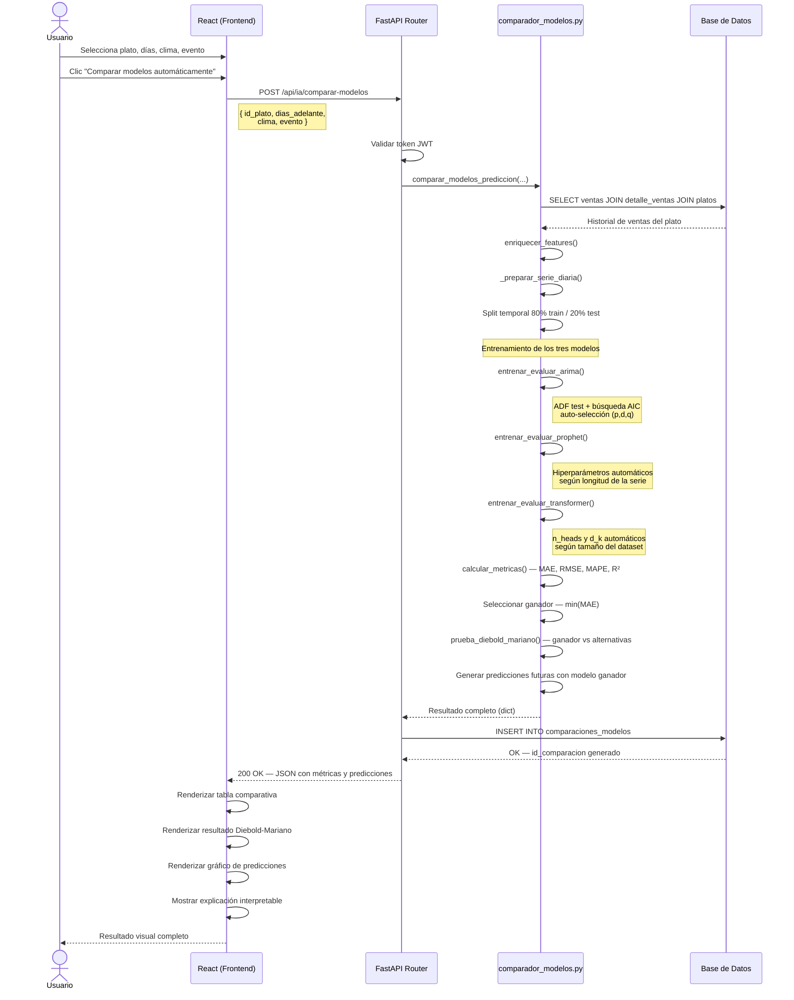

---

## Convenciones

| Símbolo / Término | Significado |
|---|---|
| `PK` | Clave primaria (Primary Key) |
| `FK` | Clave foránea (Foreign Key) |
| `\|\|--o{` | Relación uno a muchos |
| `\|\|--\|\|` | Relación uno a uno |
| MAE | Mean Absolute Error — Error Absoluto Medio |
| RMSE | Root Mean Square Error — Raíz del Error Cuadrático Medio |
| MAPE | Mean Absolute Percentage Error — Error Porcentual Absoluto Medio |
| R² | Coeficiente de determinación (bondad de ajuste) |
| DM | Estadístico Diebold-Mariano |
| MHA | Multi-Head Self-Attention |
| OOF | Out-Of-Fold (predicciones fuera de pliegue para el meta-learner) |
| AIC | Criterio de Información de Akaike (selección de orden ARIMA) |
| ADF | Augmented Dickey-Fuller (prueba de estacionariedad) |
| RBAC | Role-Based Access Control (control de acceso por roles) |
| JWT | JSON Web Token (autenticación sin estado) |

---

## 10. Flujo del Motor de Alertas Inteligentes

Muestra cómo el backend analiza el estado del sistema, detecta patrones de riesgo y genera alertas persistidas en la BD — sin depender de n8n ni servicios externos.

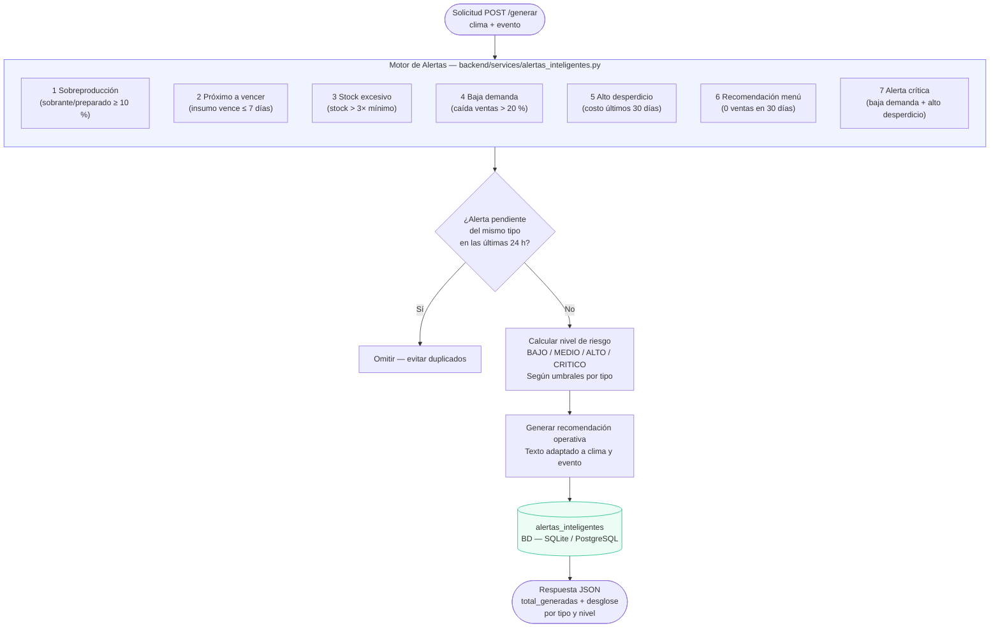

### Flujo de estados de una alerta

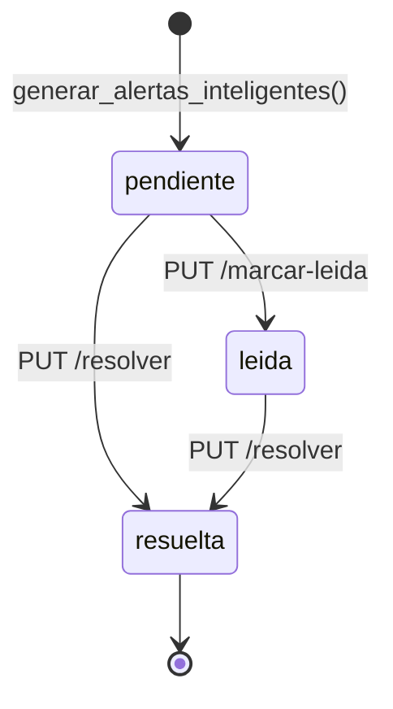

### Integración con el Dashboard

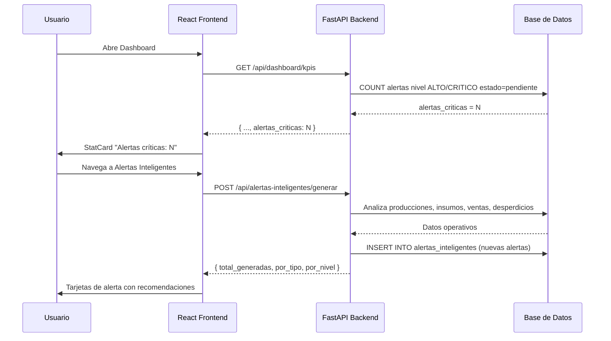

---

## Referencias

- Diebold, F.X. & Mariano, R.S. (1995). *Comparing Predictive Accuracy*. Journal of Business & Economic Statistics, 13(3), 253–263.
- Taylor, S.J. & Letham, B. (2018). *Forecasting at scale*. The American Statistician, 72(1), 37–45.
- Box, G.E.P., Jenkins, G.M. & Reinsel, G.C. (2015). *Time Series Analysis: Forecasting and Control* (5th ed.). Wiley.
- Vaswani, A. et al. (2017). *Attention is All You Need*. Advances in Neural Information Processing Systems (NeurIPS 2017).
- Newey, W.K. & West, K.D. (1987). *A Simple, Positive Semi-Definite, Heteroskedasticity and Autocorrelation Consistent Covariance Matrix*. Econometrica, 55(3), 703–708.
